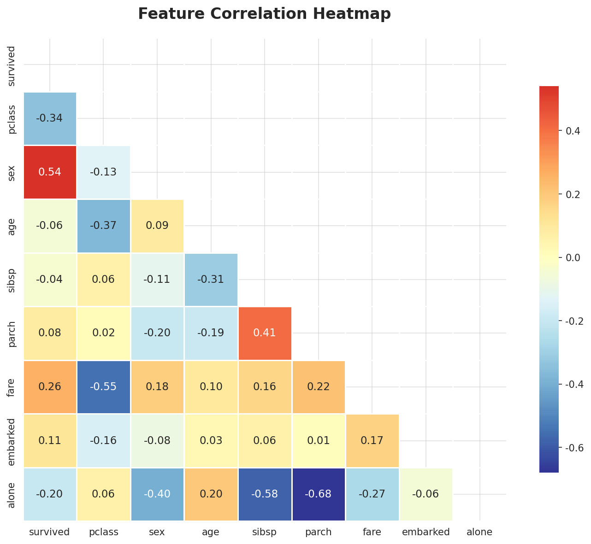
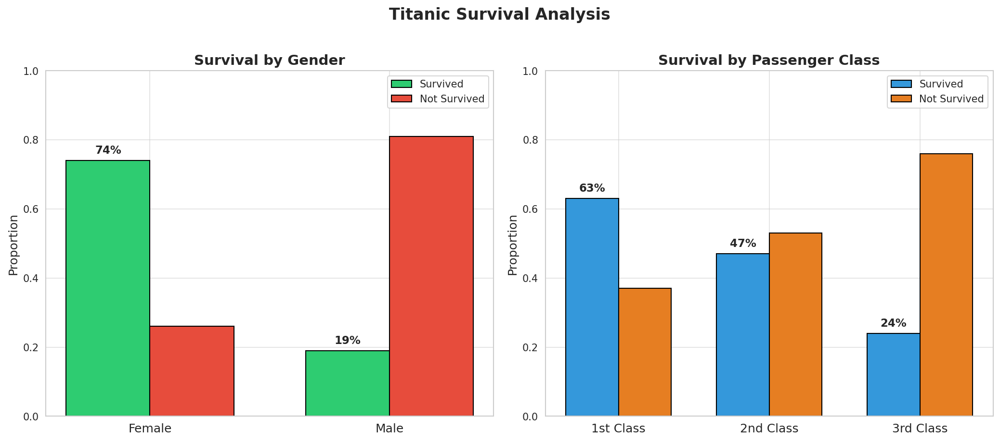
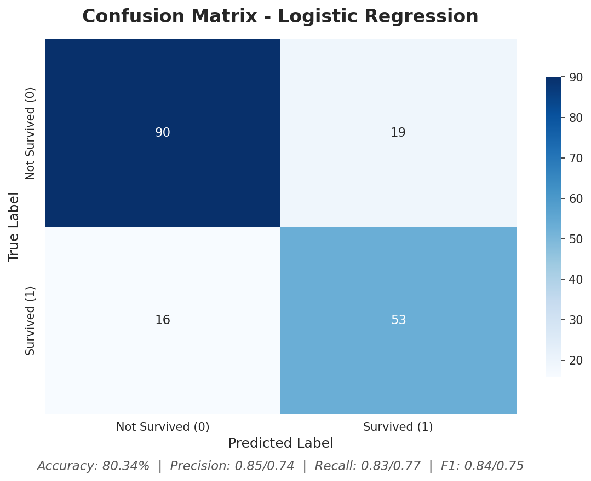
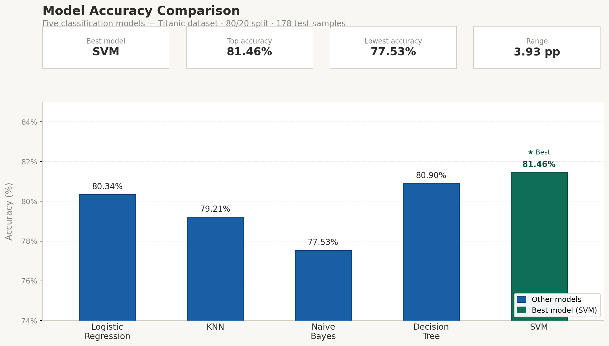

<h1 align="center">
  
  <br>
  Titanic Survival Prediction
  <br>
  
  
  
  
  
  
  
  
</h1>

<p align="center">
  <b>A Machine Learning project predicting passenger survival on the RMS Titanic using the Seaborn built-in dataset.</b><br>
   Best Accuracy: <b>81.46%</b> with Support Vector Machine (RBF)
</p>

<p align="center">
  <a href="#-overview">Overview</a> •
  <a href="#-dataset">Dataset</a> •
  <a href="#-features">Features</a> •
  <a href="#-preprocessing">Preprocessing</a> •
  <a href="#-models-used">Models</a> •
  <a href="#-results">Results</a> •
  <a href="#-screenshots">Screenshots</a> •
  <a href="#-installation">Installation</a>
</p>

---

## 📖 Overview

The sinking of the **RMS Titanic** is one of the most infamous shipwrecks in history. On April 15, 1912, the Titanic sank after colliding with an iceberg, killing **1,502 out of 2,224** passengers and crew.

This project applies **five classification algorithms** — Logistic Regression, K-Nearest Neighbors, Naive Bayes, Decision Tree, and Support Vector Machine — to the Seaborn Titanic dataset to predict passenger survival based on demographic and ticket information.

---

## 📊 Dataset

This project uses the built-in **Seaborn Titanic dataset** (`sns.load_dataset("titanic")`), which contains:

| Detail | Value |
|--------|-------|
| **Total Entries** | 891 passengers |
| **Features** | 15 columns (before cleaning) |
| **Target** | `survived` (0 = No, 1 = Yes) |

**Columns in raw data:** `survived`, `pclass`, `sex`, `age`, `sibsp`, `parch`, `fare`, `embarked`, `class`, `who`, `adult_male`, `deck`, `embark_town`, `alive`, `alone`

---

## ✨ Features & Cleaning

### Dropped Columns
The following columns were removed as they were either redundant or had excessive missing values:

- `deck` — 688 missing values (77% missing)
- `embark_town` — redundant with `embarked`
- `alive` — redundant with `survived`
- `class` — redundant with `pclass`
- `who` — redundant with `sex` + `age`
- `adult_male` — redundant with `sex`

### Missing Value Handling
| Column | Strategy |
|--------|----------|
| `age` | Filled with **mean age** |
| `embarked` | Dropped **2 rows** with missing values |

### Encoding
| Column | Method |
|--------|--------|
| `sex` | Label Encoding (male=1, female=0) |
| `embarked` | Label Encoding (S=2, C=0, Q=1) |

All features were cast to **integer type** for model compatibility.

### Final Feature Set
```
survived, pclass, sex, age, sibsp, parch, fare, embarked, alone
```

---

## ⚙️ Preprocessing

- **Train-Test Split:** 80% train / 20% test (`random_state=42`)
- **Scaling:** `StandardScaler` applied to **KNN, Decision Tree, and SVM** (distance/kernel-based algorithms)
- No feature engineering (FamilySize, Title extraction, etc.) was performed
- No hyperparameter tuning was performed

---

## 🤖 Models Used

Five classification models were trained and evaluated:

| # | Model | Library | Scaling |
|---|-------|---------|---------|
| 1 | **Logistic Regression** | `sklearn.linear_model.LogisticRegression()` | None |
| 2 | **K-Nearest Neighbors (k=5)** | `sklearn.neighbors.KNeighborsClassifier(n_neighbors=5)` | StandardScaler |
| 3 | **Gaussian Naive Bayes** | `sklearn.naive_bayes.GaussianNB()` | None |
| 4 | **Decision Tree** | `sklearn.tree.DecisionTreeClassifier()` | StandardScaler |
| 5 | **Support Vector Machine (RBF)** | `sklearn.svm.SVC(kernel="rbf")` | StandardScaler |

---

## 🏆 Results

### Accuracy Comparison

| Rank | Model | Accuracy |
|:----:|-------|:--------:|
| 🥇 | **Support Vector Machine (RBF)** | **81.46%** |
| 🥈 | Decision Tree | 80.90% |
| 🥉 | Logistic Regression | 80.34% |
| 4️⃣ | K-Nearest Neighbors (k=5) | 79.21% |
| 5️⃣ | Gaussian Naive Bayes | 77.53% |

### Detailed Metrics

#### Logistic Regression
```
              precision    recall  f1-score   support

           0       0.85      0.83      0.84       109
           1       0.74      0.77      0.75        69

    accuracy                           0.80       178
   macro avg       0.79      0.80      0.79       178
weighted avg       0.81      0.80      0.80       178
```
**Confusion Matrix:** `[[90, 19], [16, 53]]`

#### K-Nearest Neighbors (k=5)
```
              precision    recall  f1-score   support

           0       0.84      0.82      0.83       109
           1       0.72      0.75      0.74        69

    accuracy                           0.79       178
   macro avg       0.78      0.79      0.78       178
weighted avg       0.79      0.79      0.79       178
```
**Confusion Matrix:** `[[89, 20], [17, 52]]`

#### Gaussian Naive Bayes
```
              precision    recall  f1-score   support

           0       0.85      0.77      0.81       109
           1       0.68      0.78      0.73        69

    accuracy                           0.78       178
   macro avg       0.77      0.78      0.77       178
weighted avg       0.78      0.78      0.78       178
```
**Confusion Matrix:** `[[84, 25], [15, 54]]`

#### Decision Tree
```
              precision    recall  f1-score   support

           0       0.86      0.83      0.84       109
           1       0.74      0.78      0.76        69

    accuracy                           0.81       178
   macro avg       0.80      0.80      0.80       178
weighted avg       0.81      0.81      0.81       178
```
**Confusion Matrix:** `[[90, 19], [15, 54]]`

#### Support Vector Machine — RBF (Best Model)
```
              precision    recall  f1-score   support

           0       0.86      0.83      0.85       109
           1       0.75      0.78      0.77        69

    accuracy                           0.81       178
   macro avg       0.80      0.81      0.81       178
weighted avg       0.82      0.81      0.82       178
```
**Confusion Matrix:** `[[91, 18], [15, 54]]`

---

## 📸 Screenshots

### 1. Correlation Heatmap
<p align="center">
  
  <br>
  <i>Feature correlation analysis on the cleaned dataset</i>
</p>

### 2. Survival by Gender & Class
<p align="center">
  
  <br>
  <i>Females and 1st-class passengers had significantly higher survival rates</i>
</p>

### 3. Confusion Matrix - Logistic Regression
<p align="center">
  
  <br>
  <i>Logistic Regression performance on the test set (178 samples)</i>
</p>

### 4. Model Accuracy Comparison
<p align="center">
  
  <br>
  <i>Accuracy comparison across all five classification models</i>
</p>

---

## 📂 Project Structure

```
titanic-survival-prediction/
│
├── 📄 titanic_survival.ipynb    # Main Jupyter Notebook with full pipeline
├── 📄 requirements.txt          # Python dependencies
├── 📄 README.md                 # Project documentation
├── 📄 LICENSE                   # MIT License
│
└── 📁 screenshots/
    ├── eda_heatmap.png
    ├── survival_by_gender.png
    ├── model_comparison.png
    └── confusion_matrix.png
```

---

## 🛠 Tech Stack

| Category | Tools & Libraries |
|----------|-------------------|
| **Language** |  |
| **Data Processing** |   |
| **Visualization** |   |
| **ML / AI** |  |
| **Environment** |  |
| **Version Control** |   |

---

## ⚡ Installation

### 1. Clone the repository
```bash
git clone https://github.com/divyanshsinghtomar-official/titanic-survival-prediction.git
cd titanic-survival-prediction
```

### 2. Create a virtual environment (recommended)
```bash
python -m venv venv

# On Windows
venv\Scripts\activate

# On macOS/Linux
source venv/bin/activate
```

### 3. Install dependencies
```bash
pip install -r requirements.txt
```

### 4. Launch Jupyter Notebook
```bash
jupyter notebook
```
Open `titanic_survival.ipynb` and run the cells step-by-step.

---

## 🚀 Future Improvements

- [x] Add **Decision Tree** classifier
- [x] Add **Support Vector Machine (SVM)** with RBF kernel
- [ ] Add **Feature Engineering** (FamilySize, Title extraction, Age bins)
- [ ] Implement **Hyperparameter Tuning** (GridSearchCV for KNN k-value, SVM C/gamma)
- [ ] Try additional models: **Random Forest**, **XGBoost**
- [ ] Add **Cross-Validation** (K-Fold) for more robust evaluation
- [ ] Deploy as a **Streamlit Web App** for interactive predictions
- [ ] Generate **Kaggle-style submission CSV**

---

## 🤝 Contributing

Contributions are welcome! If you'd like to improve this project:

1. 🍴 Fork the repository
2. 🌿 Create your feature branch (`git checkout -b feature/AmazingFeature`)
3. 💾 Commit your changes (`git commit -m 'Add some AmazingFeature'`)
4. 📤 Push to the branch (`git push origin feature/AmazingFeature`)
5. 🔁 Open a Pull Request

---

## 📜 License

This project is licensed under the **MIT License** — see the [LICENSE](LICENSE) file for details.

---

## 🙏 Acknowledgments

- 📚 Dataset: Seaborn built-in Titanic dataset (`sns.load_dataset("titanic")`)
- 🧑‍💻 Built with Scikit-Learn, Pandas, NumPy, Matplotlib & Seaborn
- ⭐ If you found this helpful, please **star** the repo!

---

<p align="center">
  <b>Made with ❤️ by <a href="https://github.com/divyanshsinghtomar-official">Divyansh Singh Tomar</a></b>
  <br>
  <a href="https://github.com/divyanshsinghtomar-official/titanic-survival-prediction/stargazers">⭐ Star this repo</a> •
  <a href="https://github.com/divyanshsinghtomar-official/titanic-survival-prediction/issues">🐛 Report Bug</a>
</p>